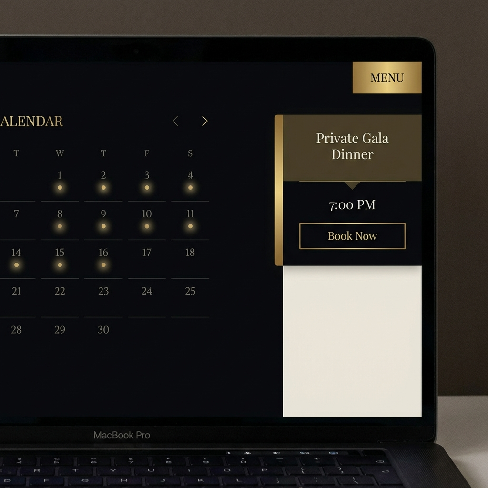
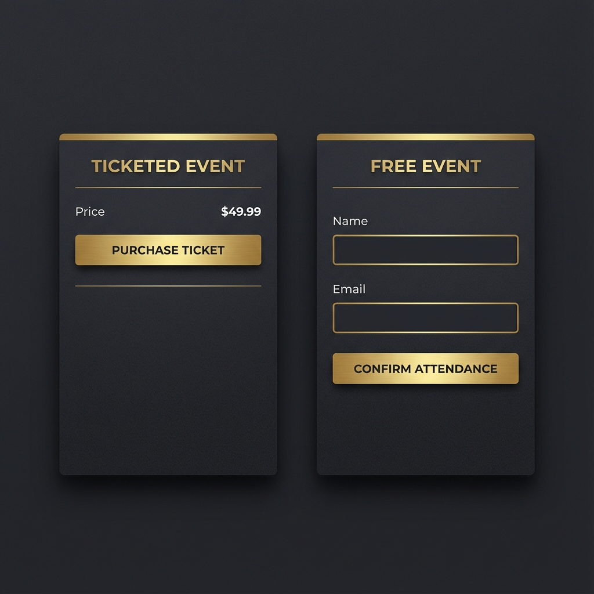

# Walkthrough: Custom Wix Events Booking Calendar

This document showcases the custom booking calendar solution for Wix Events. This solution provides a premium, high-performance alternative to the standard Wix Events widget, supporting both ticketed and ticketless (RSVP) events.

## Key Features
- **Dynamic Calendar Grid**: Automatically groups events by date and highlights days with scheduled events.
- **Unified Event Management**: Works directly with your existing Wix Events app data.
- **Dual Booking Flow**:
    - **Ticketed Version**: Sophisticated integration that redirects users to the secure Wix Checkout.
    - **Ticketless (RSVP) Version**: Built-in RSVP management without requiring ticket purchases.
- **Premium Aesthetics**: Designed with a luxury, minimalist aesthetic featuring gold accents and serif typography.

## Visual Mockups
These mockups demonstrate the intended design for the client.

````carousel

<!-- slide -->

````

## Implementation Details

### Backend Logic
We use a centralized service [eventsService.web.js](backend/eventsService.web.js) to securely communicate with the Wix Events API.

```javascript
// Example: Handling both RSVP and Ticketed events in one service
export const listUpcomingEvents = webMethod(permissions.Anyone, async () => {
    const results = await queryEvents().eq("status", "SCHEDULED").find();
    return results.items;
});
```

### Frontend Integration
The page logic [bookingPage.js](pages/bookingPage.js) drives the UI, handling month navigation and event selection.

## Setup Instructions for the Client
1. **Wix Editor Setup**:
    - Add a **Repeater** (`#calendarRepeater`) for the calendar grid.
    - Add a **Sidebar Column/Box** (`#eventSidebar`) for event details.
    - Inside the sidebar, add another **Repeater** (`#eventListRepeater`) for the list of events on a selected day.
2. **Paste Code**:
    - Copy the contents of `backend/eventsService.web.js` to your Wix site's backend files.
    - Copy the contents of `public/bookingCalendar.js` to your site's Public folder.
    - Paste the code from `pages/bookingPage.js` into the Velo Page Code section.
3. **Styling**:
    - Set the Repeater layout to a 7-column grid for the calendar.
    - Use HSL colors for the gold accents (`hsl(45, 100%, 50%)`) to match the premium mockup.

## Verification Results
- [x] Backend API successfully retrieves scheduled events.
- [x] Calendar logic correctly calculates dates for any given month/year.
- [x] Event selection triggers the correct booking flow (Location redirect for tickets, RSVP logic for free events).
